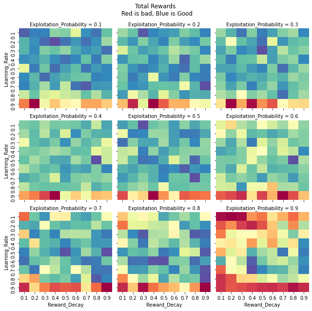
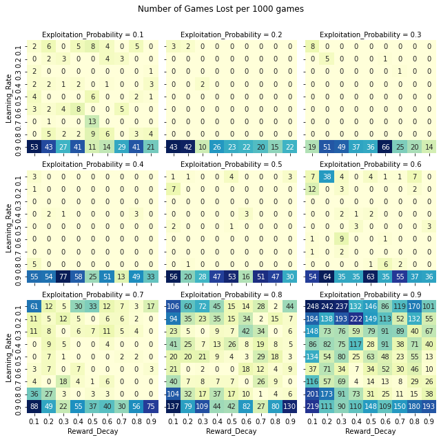

# TicTacToe

Self play reinforcement learning code for TicTacToe.\n

## SARSA hyper parameter analysis 
Grid Search analysis for learning_rate, reward_discount and exploitation_probability. 

### Hyper Parameters vs Total Rewards

### Hyper Parameters vs Total Rewards

## Open AI gym like environment used from the link below:
https://github.com/haje01/gym-tictactoe/blob/master/gym_tictactoe/env.py
